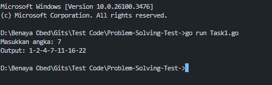
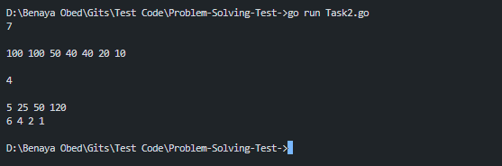
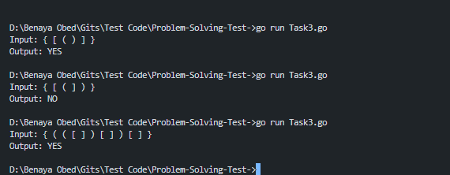

# Problem-Solving-Test

## 1️⃣ Soal: A000124 of Sloane’s OEIS

Buatlah sebuah program yang menghasilkan deret berdasarkan **A000124** dari **Sloane’s OEIS**.  
Input harus dinamis, sehingga dapat menghasilkan output yang berbeda sesuai angka yang dimasukkan.

### **Contoh Input & Output:**

---

## 2️⃣ Soal: Dense Ranking

GITS sedang bermain permainan arcade, dan ingin mengetahui peringkatnya setelah setiap permainan menggunakan skema **Dense Ranking**.

### **Contoh Input & Output:**

---

## 3️⃣ Soal: Balanced Bracket

Program ini digunakan untuk menentukan apakah **bracket dalam suatu string seimbang** atau tidak.

### **Aturan Bracket:**
1. Karakter yang diperbolehkan: `{`, `}`, `[`, `]`, `(`, `)`.
2. Bracket bisa dipisahkan dengan atau tanpa whitespace.
3. **Setiap bracket buka harus memiliki bracket tutup yang sesuai.**
4. **Bracket harus tertutup dalam urutan yang benar** (**LIFO - Last In, First Out**).

---

### **Contoh Input & Output:**

---

## 📌 **Penjelasan**
### **Sample 1:**
✅ `{}`  
✅ `[]`  
✅ `()`  
**Semua bracket memiliki pasangan dan seimbang.**

### **Sample 2:**
❌ `(` tidak ditutup dengan `)`, karena `]` muncul lebih awal.  
**Bracket tidak valid.**

### **Sample 3:**
✅ `{}`  
✅ `[]`  
✅ `()`  
**Semua bracket memiliki pasangan dan seimbang.**

---

## **Analisis Kompleksitas**
### **Fungsi dengan Kompleksitas Paling Rendah**
- Algoritma ini menggunakan stack untuk menyimpan bracket buka dan mencocokkannya dengan bracket tutup secara LIFO (Last In, First Out).
- Setiap karakter hanya diakses satu kali.
- Operasi stack (push/pop) berjalan dalam O(1).
- Total kompleksitas waktu: O(n).

📌 **Mengapa O(n)?**
- **Kita melakukan satu kali traversal terhadap string** (**O(n)**).
- **Operasi dalam map untuk pengecekan bracket buka/tutup berjalan dalam O(1)**.
- **Operasi push/pop stack juga berjalan dalam O(1)**.
- **Sehingga, kompleksitas keseluruhan adalah O(n).**

---

### **Detail Kompleksitas untuk Balanced Bracket**
#### **Kompleksitas Waktu (Time Complexity)**
| Operasi            | Kompleksitas |
|--------------------|-------------|
| Iterasi melalui string | **O(n)** |
| Push/pop stack    | **O(1)** |
| Map lookup        | **O(1)** |
| **Total Kompleksitas** | **O(n)** |

📌 **Penjelasan:**
- **Kita hanya perlu melalui string satu kali** untuk mengecek bracket.
- **Operasi push ke stack terjadi O(n/2)** dalam kasus terburuk (**semua bracket buka sebelum ada bracket tutup**).
- **Operasi pop dari stack terjadi O(n/2)** dalam kasus terbaik (**setiap bracket segera ditutup**).
- **Sehingga, kompleksitas total tetap O(n).**
